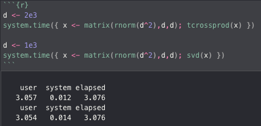
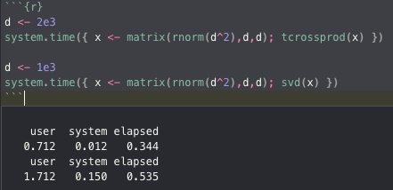
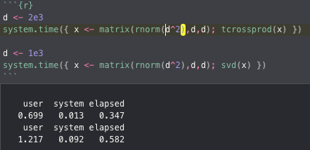
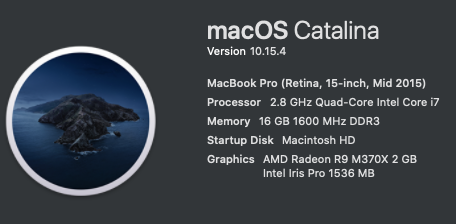

# multicore-R-benchmark

## Description

This script allows one to modify R to use multicore libraries. This in part speeds up the R language, this especially noticeable when opening text based and other data files or when matrix calculations are involved. This script modifies MacOS' symlinks (related to the R installation) so it used the `vecLib` library and the `libLAPACK.dylib` library instead; which are much faster.

Run the chunks below to see the results. Images are provided instead in the [README.md](./README.md) for this repository. For easy use run the included [multicore-R-benchmark.Rmd](./multicore-R-benchmark.Rmd).

**Disclaimer:** This script is provided as is, no guarantee is promised. Any damages to your system/installation are your own responsibility.

## Results

<p align="center">
    
    
    
</p>

In order of appearance left to right benchmarks for: Normal R, `libLAPACK-dylib`, `libLAPACK-dylib` and `macOS-blas`.

As you can see modifying R to use these other multi-threaded libraries can significantly speed up performance.


## System information

My machine at the time is the following: 

<p align="center">
    
</p>


# Benchmark script

```{r}
d <- 2e3
system.time({ x <- matrix(rnorm(d^2),d,d); tcrossprod(x) })

d <- 1e3
system.time({ x <- matrix(rnorm(d^2),d,d); svd(x) })
```


# Use the faster vecLib library

* https://gist.github.com/nicebread/6920c8287d7bffb03007
These code snippets have been tested on R 4.0.2 and MacOS Catalina 10.15.4. They presumably do *not* work on R 2.X!

Enter these commands in the Mac OS Terminal

```{bash}
cd /Library/Frameworks/R.framework/Resources/lib
ln -sf /System/Library/Frameworks/Accelerate.framework/Frameworks/vecLib.framework/Versions/Current/libBLAS.dylib libRblas.dylib


# return to default settings
cd /Library/Frameworks/R.framework/Resources/lib
ln -sf libRblas.0.dylib libRblas.dylib
```

# symlink the libLAPACK.dylib to R in place of the libRlapack.dylib

```{bash}
cd /Library/Frameworks/R.framework/Resources/lib
mv libRlapack.dylib libRlapack.dylib.backup
ln -sf /System/Library/Frameworks/Accelerate.framework/Frameworks/vecLib.framework/Versions/Current/libLAPACK.dylib libRlapack.dylib
```

# More benchmarking

Here you can find another larger script for more rigorous benchmarking: http://r.research.att.com/benchmarks/R-benchmark-25.R

This was run on 2011 Macbook Pro (2.7 GHz Core i7): 43 sec. (Rblas) vs. 9 sec. (vecLib)